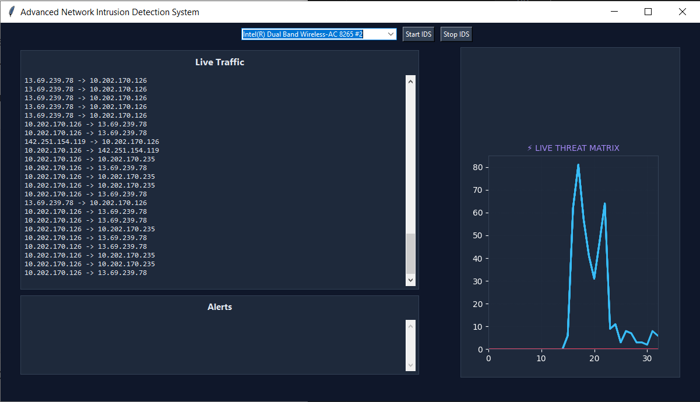
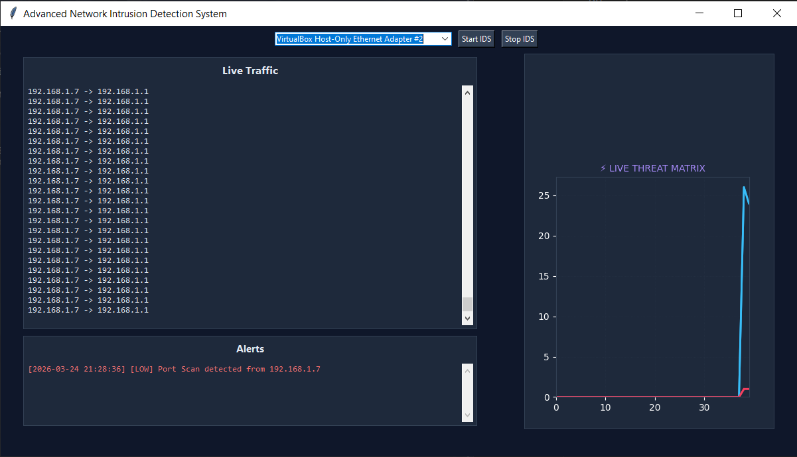
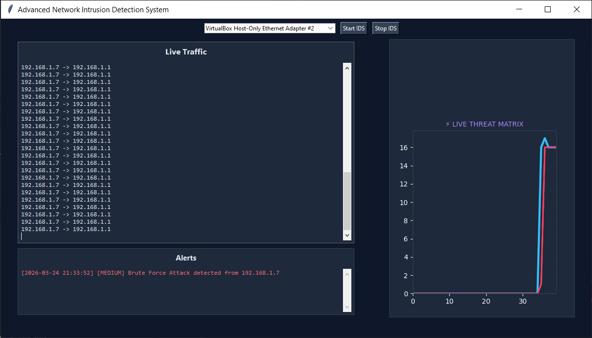
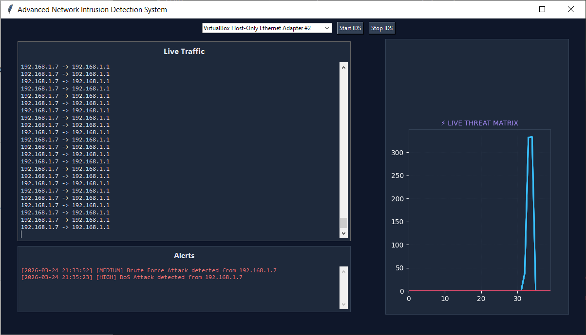

# 🛡️ Advanced Network Intrusion Detection System (NIDS)

A real-time **Network Intrusion Detection System (NIDS)** developed using Python that captures live network traffic, analyzes behavior, and detects cyber attacks such as **Port Scans, Brute Force Attacks, and DoS Attacks** through an interactive graphical dashboard.

---

## 📌 Project Overview

This project simulates a real-world **Intrusion Detection System** capable of monitoring network traffic and identifying suspicious activities using rule-based detection techniques.

The system provides:
- Live packet monitoring  
- Real-time threat detection  
- Alert generation with severity levels  
- Graph-based traffic visualization  

---

## 🖥️ Dashboard Demonstration

### 🔹 1. Normal Traffic Monitoring

---

### 🔴 2. Port Scan Detection (LOW Severity)

📌 Example Output:
[LOW] Port Scan detected from 192.168.1.7

---

### 🟠 3. Brute Force Attack Detection (MEDIUM Severity)

📌 Example Output:
[MEDIUM] Brute Force Attack detected from 192.168.1.7

---

### 🔥 4. DoS Attack Detection (HIGH Severity)

📌 Example Output:
[HIGH] DoS Attack detected from 192.168.1.7

---

## 🚀 Features

- 📡 **Live Packet Capture** using Scapy  
- 🧠 **Traffic Analysis Engine**  
- 🚨 **Attack Detection Modules**:
  - Port Scan Detection (LOW)
  - Brute Force Detection (MEDIUM)
  - DoS Attack Detection (HIGH)
- 📊 **Real-time Graph Visualization**
- 🖥️ **GUI Dashboard (Tkinter + Matplotlib)**
- 📝 **Alert Logging System**
- 🔌 **Network Interface Selection**

---

## 🧱 Project Structure

GUI_NIDS/
│
├── core/
│ ├── config.py
│ └── event_bus.py
│
├── engine/
│ ├── packet_capture.py
│ ├── traffic_analyzer.py
│ ├── detection.py
│ ├── alert_system.py
│ └── stats.py
│
├── gui/
│ ├── dashboard.py
│ ├── interface_selector.py
│ ├── live_graph.py
│ └── traffic_graph.py
│
├── data/
│ └── alerts.log
│
├── main.py
├── requirements.txt
└── README.md

---

## ⚙️ Technologies Used

- Python 3.x  
- Scapy (Packet Capture)  
- Tkinter (GUI Development)  
- Matplotlib (Data Visualization)  
- Threading & Queue (Real-time processing)  
- VirtualBox (Testing environment)  

---

## 📊 Graph Explanation

- 🔵 Blue Line → Packet traffic volume  
- 🔴 Red Line → Threat level indicator  

Traffic spikes indicate potential attacks:
- Small spike → Port Scan  
- Medium spike → Brute Force  
- Large spike → DoS Attack  

---

## 🛠️ Installation & Setup

### 1. Clone the Repository
git clone https://github.com/jatin-rajputt/nids-project.git
cd nids-project

---

### 2. Install Dependencies
pip install -r requirements.txt

---

### 3. Run the Project

python main.py

---

## 🧠 How It Works

1. **Packet Capture**
   - Captures live packets from selected network interface  

2. **Traffic Analyzer**
   - Processes packet data and identifies patterns  

3. **Detection Engine**
   - Applies rule-based logic to detect attacks  

4. **Alert System**
   - Logs alerts and displays them in GUI  

5. **Visualization**
   - Updates graphs in real-time  

---

## 📁 Log File Example
[2026-03-24 21:33:52] [MEDIUM] Brute Force Attack detected from 192.168.1.7
[2026-03-24 21:35:23] [HIGH] DoS Attack detected from 192.168.1.7

---

## 👥 Team Members

- Jatin 
- Komal Patoa
- Krishna Mukesh 

---

## 🎓 Viva Explanation

> “This project is a real-time Network Intrusion Detection System that captures live network traffic using Scapy, analyzes it, and detects attacks like Port Scan, Brute Force, and DoS using rule-based detection. The results are visualized through a GUI dashboard with alerts and graphs.”

---

## 🚀 Future Enhancements

- Machine Learning-based detection  
- Signature-based attack detection  
- Email/SMS alert integration  
- Web-based dashboard  

---

## 🏁 Conclusion

This project demonstrates a **practical implementation of a Network Intrusion Detection System**, combining networking, cybersecurity, and real-time visualization to effectively detect and analyze threats.

---

⭐ If you found this project useful, consider giving it a star!
