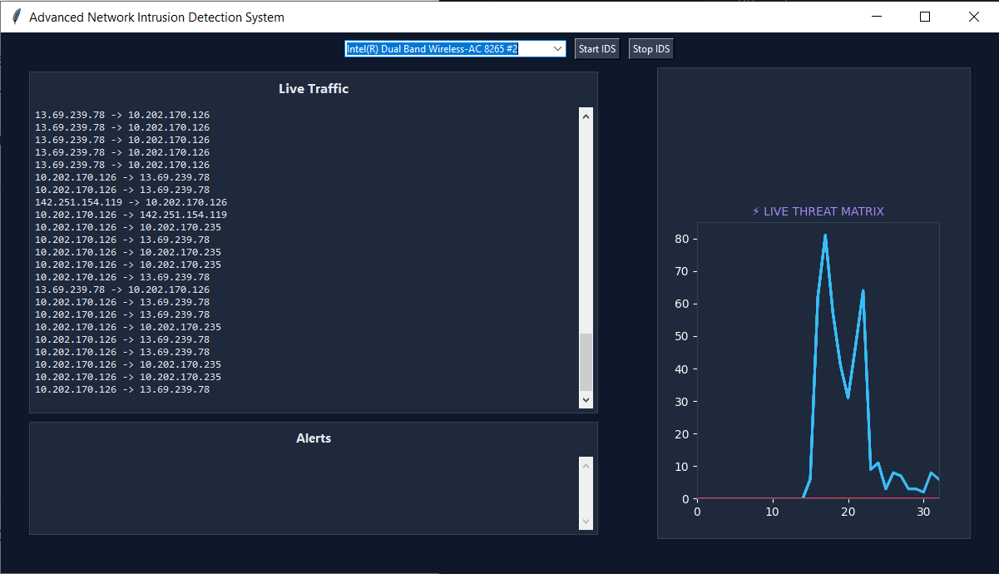
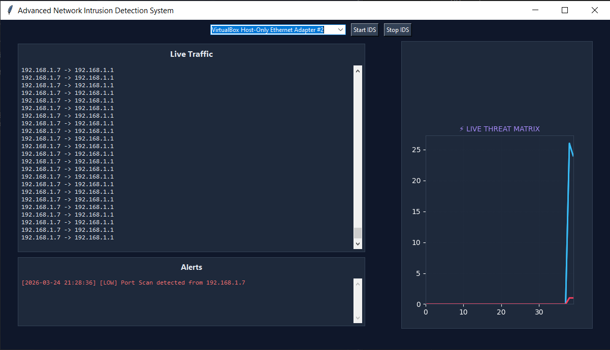
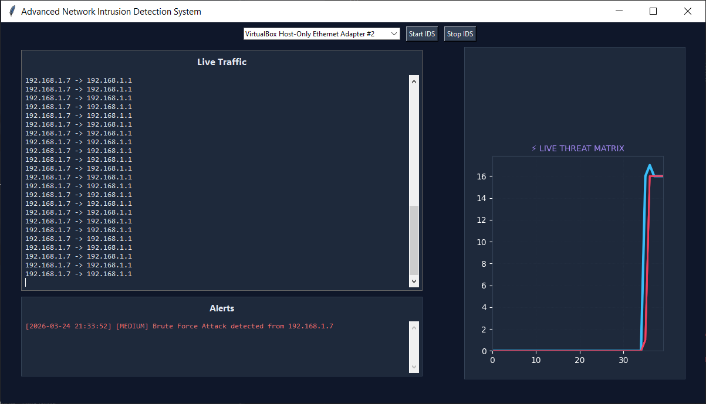
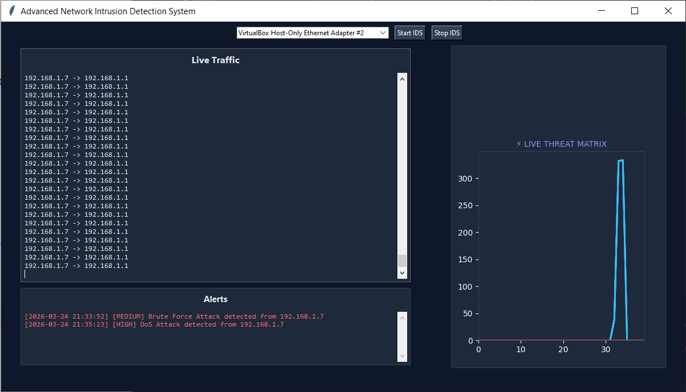
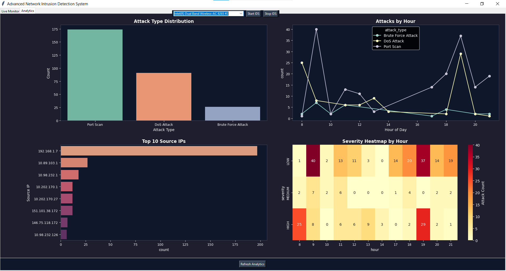

# 🛡️ Advanced Network Intrusion Detection System (NIDS)

A real-time **Network Intrusion Detection System (NIDS)** developed using Python that captures live network traffic, analyzes behavior, and detects cyber attacks such as **Port Scans, Brute Force Attacks, and DoS Attacks** through an interactive graphical dashboard.

---

## 📌 Project Overview

This project simulates a real-world **Intrusion Detection System** capable of monitoring network traffic and identifying suspicious activities using rule-based detection techniques.

The system provides:
- Live packet monitoring 
- Real-time threat detection 
- Telegram instant alert generation with severity levels 
- Graph-based traffic visualization and historical analytics

---

## 🖥️ Dashboard Demonstration

### 🔹 1. Normal Traffic Monitoring


---

### 🔴 2. Port Scan Detection (LOW Severity)


📌 Example Output:
`[LOW] Port Scan detected from 192.168.1.7`

---

### 🟠 3. Brute Force Attack Detection (MEDIUM Severity)


📌 Example Output:
`[MEDIUM] Brute Force Attack detected from 192.168.1.7`

---

### 🔥 4. DoS Attack Detection (HIGH Severity)


📌 Example Output:
`[HIGH] DoS Attack detected from 192.168.1.7`

---
---

### 📊 5. Historical Analytics Dashboard


The **Analytics** tab provides a macro-level overview of network threat intelligence collected over time. It breaks down raw log data into actionable security insights across four core metrics:

* 📊 **Attack Type Distribution (Top-Left):** A categorical breakdown showing which attack methodologies are targeting the network most frequently. (e.g., Identifying that *Port Scans* represent the highest sheer volume of attempts).
* 📈 **Attacks by Hour (Top-Right):** A chronological line chart mapping out attack frequencies throughout the day. This helps identify "peak threat windows" or automated attack scripts scheduled at specific hours.
* 🗺️ **Top 10 Source IPs (Bottom-Left):** A horizontal ranking of the most malicious or aggressive IP addresses on the network. Crucial for identifying persistent attackers (like `192.168.1.7`) that require immediate firewall blocking.
* 🔥 **Severity Heatmap by Hour (Bottom-Right):** A matrix tracking the density of **LOW**, **MEDIUM**, and **HIGH** severity events per hour, letting security teams quickly pinpoint high-risk periods (such as a sudden surge of 29 HIGH-severity alerts at hour 19).

## 🚀 Features

- 📡 **Live Packet Capture** using Scapy  
- 🧠 **Traffic Analysis Engine** - 🚨 **Attack Detection Modules**:
  - Port Scan Detection (LOW)
  - Brute Force Detection (MEDIUM)
  - DoS Attack Detection (HIGH)
- 📊 **Real-time Graph & Analytics Visualization**
- 🖥️ **GUI Dashboard (Tkinter + Matplotlib)**
- 📲 **Telegram Alert Notification System** (Instant remote alerts)
- 📝 **Alert Logging System**
- 🔌 **Network Interface Selection**

---

## 🧱 Project Structure
```text
GUI_NIDS/
│
├── core/
│   ├── config.py
│   └── event_bus.py
│
├── engine/
│   ├── packet_capture.py
│   ├── traffic_analyzer.py
│   ├── detection.py
│   ├── alert_system.py
│   ├── notifier.py         <-- Telegram notification engine
│   └── stats.py
│
├── gui/
│   ├── dashboard.py
│   ├── interface_selector.py
│   ├── analytics_panel.py  <-- Historical analytics panel
│   ├── live_graph.py
│   └── traffic_graph.py
│
├── data/
│   └── alerts.log
│
├── .env                    <-- Local environment secrets (Git Ignored ❌)
├── .gitignore
├── main.py
├── requirements.txt
└── README.md
```

---

## ⚙️ Technologies Used

- Python 3.x
- Scapy (Packet Capture)
- Tkinter (GUI Development)
- Matplotlib / Seaborn (Data Visualization & Heatmaps)
- Requests (Telegram Bot API Communication)
- Threading & Queue (Real-time processing)
- VirtualBox (Testing environment))  

---

## 📊 Graph Explanation

- 🔵 Blue Line → Packet traffic volume  
- 🔴 Red Line → Threat level indicator  

Traffic spikes indicate potential attacks:
- Small spike → Port Scan  
- Medium spike → Brute Force  
- Large spike → DoS Attack  

---

## 🛠️ Installation & Setup

### 1. Clone the Repository
```
git clone https://github.com/jatin-rajputt/nids-project.git
cd nids-project
```
---

### 2. Install Dependencies
```
pip install -r requirements.txt
```

---

### 3. Configure Telegram Alerts (Optional)
To receive automated security alerts directly on your phone, create a file named .env in the root directory:
```
TELEGRAM_BOT_TOKEN="your_bot_token_here"
TELEGRAM_CHAT_ID="your_chat_id_here"
```

### 4. Run the Project
```
python main.py

```
---

## 🧠 How It Works

1. **Packet Capture**
   - Captures live packets from selected network interface  

2. **Traffic Analyzer**
   - Processes packet data and identifies patterns  

3. **Detection Engine**
   - Applies rule-based logic to detect attacks  

4. **Alert System**
   - Simultaneously writes alerts locally to data/alerts.log, displays them on the dashboard GUI, and forwards structural alerts instantly to your designated Telegram chat via notifier.py.

5. **Visualization**
   - Dynamically re-renders real-time line charts on the monitor tab and builds custom graphs on the analytics panel from parsed historical logs.

---

## 📁 Log File Example
[2026-03-24 21:33:52] [MEDIUM] Brute Force Attack detected from 192.168.1.7
[2026-03-24 21:35:23] [HIGH] DoS Attack detected from 192.168.1.7


---

## 👥 Team Members

- Jatin 
- Komal Patoa
- Krishna Mukesh 

---

## 🎓 Viva Explanation

> “This project is a real-time Network Intrusion Detection System that captures live network traffic using Scapy, analyzes it, and detects attacks like Port Scan, Brute Force, and DoS using rule-based detection. The results are visualized through a GUI dashboard featuring live tracking, data mining analytics from local log storage, and an automated incident response push pipeline routed through the Telegram Bot API.”

---

## 🚀 Future Enhancements

- Machine Learning-based detection  
- Signature-based attack detection  
- Email/SMS alert integration  
- Web-based dashboard  

---

## 🏁 Conclusion

This project demonstrates a practical implementation of a Network Intrusion Detection System, combining networking, cybersecurity, and data visualization to effectively detect, log, and analyze threats.


---

⭐ If you found this project useful, consider giving it a star!
